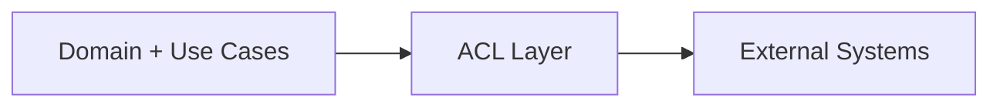

# Anti-Corruption Layer (ACL) for con7text

## 1. Зачем нужен ACL

Антикоррупционный слой изолирует доменную модель `con7text` от:
- нестабильных внешних API;
- разных форматов клиентов (MCP/HTTP/CLI);
- vendor-specific особенностей (названия полей, ошибки, статусы, лимиты).

Цель: внешние изменения не должны ломать core-домен.

## 2. Границы ACL

ACL располагается между:
- **Application/Domain** (`DocumentationQuery`, `ClientSession`, `AuditTrail`)
- **External Adapters** (MCP servers, docs APIs, SDK clients, LLM providers)

## 3. Основные обязанности ACL

1. **Translation**
   - Внешние DTO -> Domain VO
   - Domain Result -> Клиентский response contract

2. **Normalization**
   - Единые типы ошибок (`NotFound`, `RateLimited`, `Unauthorized`, `ProviderError`)
   - Единый формат метаданных (latency, provider, traceId)

3. **Policy Shielding**
   - Redaction чувствительных данных
   - Фильтрация небезопасных/лишних полей
   - Валидация схемы до входа в домен

4. **Compatibility Management**
   - Поддержка версий внешних контрактов
   - Fallback/feature-flag поведение при несовместимостях

## 4. Шаблон проектирования ACL

## 4.1 Интерфейсы (Ports)
- `ProviderPort`
- `ClientRequestPort`
- `ClientResponsePort`

## 4.2 Реализации (Adapters)
- `McpClientAdapter`
- `HttpProviderAdapter`
- `CliRequestAdapter`

## 4.3 Трансляторы
- `ExternalErrorTranslator`
- `LibraryIdTranslator`
- `ClientContextTranslator`
- `AuditPayloadTranslator`

## 5. Пример потока запроса

1. Клиент присылает запрос через MCP.
2. ACL переводит payload в `DocumentationQueryRequestVO`.
3. ACL применяет policy-check + redaction.
4. Use case выполняет доменную логику.
5. Ответ домена возвращается в ACL.
6. ACL формирует клиентский contract-ответ и audit event.

## 6. Правила для команды

- В `domain` запрещены типы внешних SDK/HTTP payload.
- Любая новая интеграция обязана иметь свой translator в ACL.
- Любая новая ошибка провайдера должна быть приведена к внутреннему error taxonomy.
- Изменения ACL сопровождаются:
  - contract tests,
  - snapshot tests,
  - backward-compatibility check.

## 7. Минимальный checklist внедрения

- [ ] Вынести текущие DTO в слой `infrastructure/acl`.
- [ ] Создать `ExternalErrorTranslator`.
- [ ] Ввести единый `ProviderError` enum.
- [ ] Добавить тесты трансляции и redaction.
- [ ] Подключить CI-проверку контрактной совместимости.
