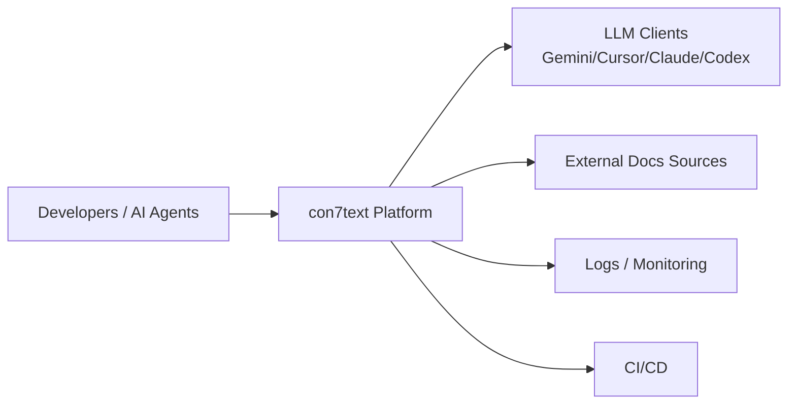
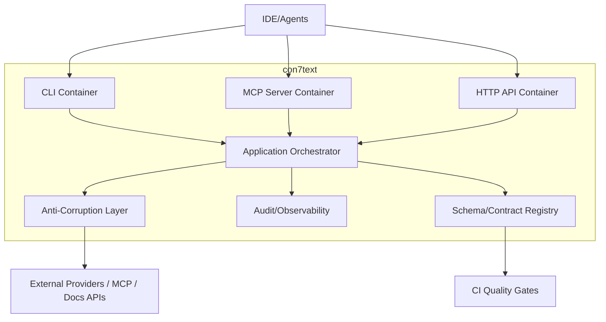
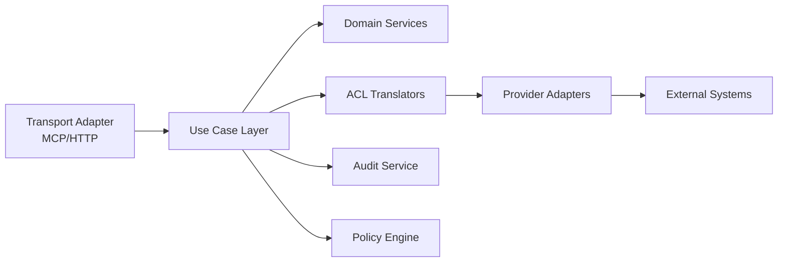

# C4 Architecture for con7text

## C1 — System Context



### Контекст
- Пользовательские клиенты обращаются к `con7text` за актуальной документацией.
- `con7text` интегрируется с внешними источниками docs и отдает унифицированный результат.

## C2 — Container Diagram



### Контейнеры
- **CLI**: локальные команды и setup.
- **MCP Server**: tool-calls и интеграция IDE-агентов.
- **HTTP API**: server-to-server доступ.
- **Orchestrator**: бизнес-флоу query -> resolve -> fetch -> respond.
- **ACL**: защита домена от внешних контрактов.
- **Audit/Observability**: логирование, trace, redaction.
- **Schema Registry**: контроль совместимости контрактов.

## C3 — Component Diagram (внутри MCP/API оркестрации)



### Компоненты
- **Transport Adapter**: нормализация входных запросов.
- **Use Case Layer**: сценарии приложения.
- **Domain Services**: инварианты и бизнес-правила.
- **ACL Translators**: трансляция внешних DTO в доменные VO.
- **Provider Adapters**: интеграции с внешними системами.
- **Audit Service**: единый trace + события.
- **Policy Engine**: security/compliance решения.

## C4 — Code Level (рекомендация)

```txt
packages/mcp/src/
  interface/
    mcp/
    http/
  application/
    use-cases/
  domain/
    entities/
    value-objects/
    services/
    events/
  infrastructure/
    acl/
    adapters/
    logging/
    schema/
```

## Архитектурные правила
- Запрещено обращаться к внешним API из `domain`.
- Любые внешние контракты проходят через `ACL`.
- Все публичные контракты версионируются и проверяются в CI.
