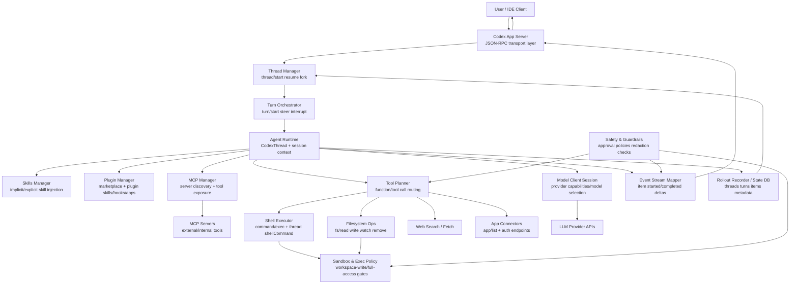
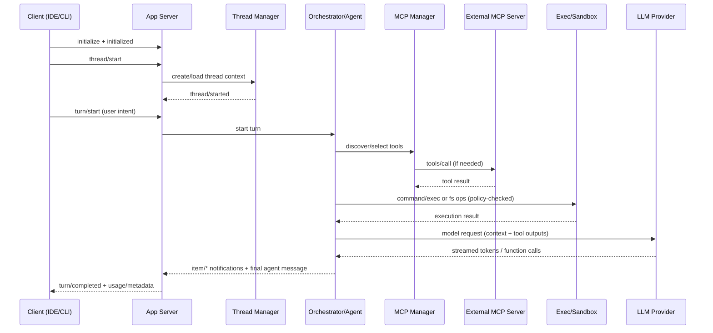

# Multiagent HLD (based on `openai/codex`)

Ниже HLD взаимодействий внутри мультиагентной системы Codex (по открытой структуре `codex-rs`, `app-server`, MCP/tooling слоям).

## Ключевые архитектурные акценты

- Оркестрация идет через `thread`/`turn` примитивы (сессии и события первого класса).
- Мультиагентность реализуется как кооперация подсистем: planner, skills/plugins, MCP manager, exec/sandbox, model client.
- Инструменты и внешние агенты подключаются через MCP и app-server API, а не через hardcoded интеграции.
- Безопасность вшита в execution path: approvals, sandbox policy, redaction и контроль событий.
